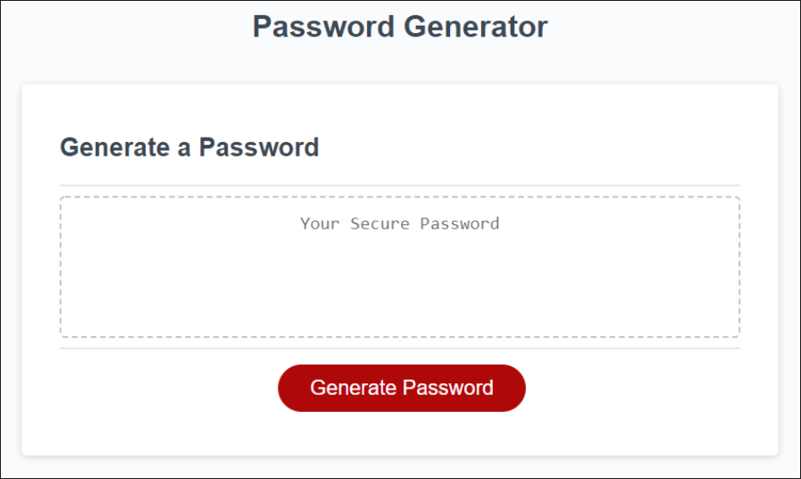
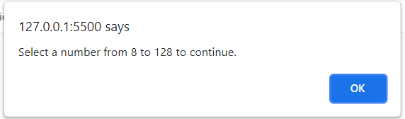
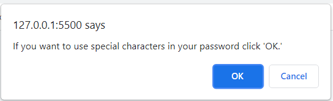
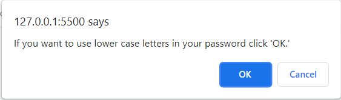
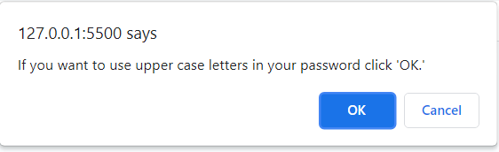
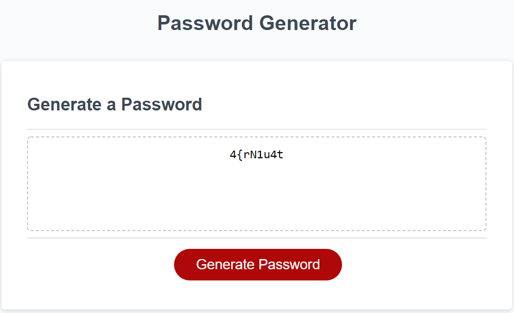

# Password Generator

## Description 
This project is about building a random password generator. With security in mind it has you select at least 8 characters all the way up to 128 for the best peace of mind for the user.

## User Story

```
AS AN employee with access to sensitive data
I WANT to randomly generate a password that meets certain criteria
SO THAT I can create a strong password that provides greater security
```
## Mock-Up



## The following images show the web application's appearance and functionality:









